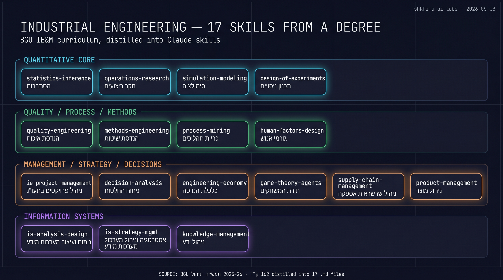

# Industrial Engineering Skills for Claude Code

**17 Claude skills distilled from a Ben-Gurion University Industrial Engineering & Management (תעשייה וניהול) degree.**



162 נק"ז · 4-year curriculum · 17 markdown files · ~2 hours to write · ready to use today.

---

## What's in here

Each skill is a `.md` file in [`skills/`](skills/) that tells Claude *how to think about* a recurring class of business decisions. They auto-load when you reference the relevant verbs in a conversation.

### 🔢 Quantitative core
| Skill | BGU course (Hebrew) | Use |
|---|---|---|
| [`statistics-inference`](skills/statistics-inference.md) | הסתברות / אמידה / רגרסיה | Hypothesis tests, CI, regression — foundation |
| [`operations-research`](skills/operations-research.md) | חקר ביצועים | LP, queueing, network optimization, scheduling |
| [`simulation-modeling`](skills/simulation-modeling.md) | סימולציה | Monte Carlo + discrete-event simulation |
| [`design-of-experiments`](skills/design-of-experiments.md) | תכנון ניסויים | A/B tests, factorial designs, ANOVA |

### ⚙️ Quality, process, methods
| Skill | BGU course | Use |
|---|---|---|
| [`quality-engineering`](skills/quality-engineering.md) | הנדסת איכות | DMAIC, SPC charts, FMEA, root cause |
| [`methods-engineering`](skills/methods-engineering.md) | הנדסת שיטות | Time studies, work standardization |
| [`process-mining`](skills/process-mining.md) | כריית תהליכים | Discover real process from logs |
| [`human-factors-design`](skills/human-factors-design.md) | הנדסת גורמי אנוש | Ergonomics, alert fatigue, UX |

### 📊 Management, strategy, decisions
| Skill | BGU course | Use |
|---|---|---|
| [`ie-project-management`](skills/ie-project-management.md) | ניהול פרויקטים | CPM/PERT, EVM, RACI |
| [`decision-analysis`](skills/decision-analysis.md) | קבלת החלטות | AHP, decision trees, MCDM |
| [`engineering-economy`](skills/engineering-economy.md) | כלכלת הנדסה + חשבונאות | NPV, IRR, ABC costing |
| [`game-theory-agents`](skills/game-theory-agents.md) | תורת המשחקים | Nash, mechanism design, multi-agent |
| [`supply-chain-management`](skills/supply-chain-management.md) | ניהול שרשרת אספקה | Vendor portfolio, single-source risk |
| [`product-management`](skills/product-management.md) | ניהול מוצרי היי-טק | RICE, PMF, lifecycle |

### 💻 Information Systems
| Skill | BGU course | Use |
|---|---|---|
| [`is-analysis-design`](skills/is-analysis-design.md) | ניתוח ועיצוב מע"מ | UML, requirements, C4 |
| [`is-strategy-mgmt`](skills/is-strategy-mgmt.md) | אסטרטגיה וניהול IS | McFarlan grid, build/buy/partner |
| [`knowledge-management`](skills/knowledge-management.md) | ניהול ידע | SECI, lessons-learned, KM strategy |

Full BGU course-to-skill mapping (including which courses are covered by other existing tools): [`CURRICULUM-MAP.md`](CURRICULUM-MAP.md).

---

## How to use

### Option 1 — drop the folder
```bash
git clone https://github.com/shkhina-ai-labs/industrial-engineering-skills.git
mkdir -p ~/.claude/skills
for f in industrial-engineering-skills/skills/*.md; do
  name=$(basename "$f" .md)
  mkdir -p ~/.claude/skills/$name
  cp "$f" ~/.claude/skills/$name/SKILL.md
done
```

### Option 2 — download the zip
Grab [`ie-skills-bundle.zip`](ie-skills-bundle.zip) (55 KB), unzip, and place each `.md` as `~/.claude/skills/<name>/SKILL.md`.

### Option 3 — cherry-pick
Open the `.md` you want, copy it to `~/.claude/skills/<name>/SKILL.md`. Each skill is self-contained.

Once placed, Claude Code auto-loads them when the description matches your conversation — no further setup needed.

---

## What's a "skill"?

A markdown file that tells Claude **how to think** about a recurring decision. Not what to code — *how to reason*. They have a small frontmatter (name + description with trigger conditions) and a structured body (when to use, methods, examples, cross-references).

Each skill in this suite includes:
- Trigger conditions (when Claude should auto-load it)
- Core methods from the source course
- Specific application examples
- A `Use the Agent tool…` block for spawning a sub-agent on novel problems
- Cross-references to other skills in the chain

---

## Source

[BGU Faculty of Engineering Sciences — Department of Industrial Engineering & Management](https://in.bgu.ac.il/engn/iem/) · [Yearbook 2025-26 PDF (primary source)](https://www.bgu.ac.il/media/bvnhtwad/364-2026.pdf).

The skills cite specific BGU course codes (e.g. `364-1-3051`) and credit counts (`נק"ז`) so you can map back to the academic material.

---

## Contributing

PRs welcome. Especially:
- Additional electives from the same curriculum (cognitive robotics, IIoT, BI deep-dive, etc.)
- Better Shkhina-specific application examples
- The `references/` files (each skill lists TODO references — templates, recipes, decision trees — that get populated as people use the skill in real work)
- Translation of skill bodies to Hebrew

---

## Why does this exist?

Solo founder operating a 5-server AI consultancy using Claude Code. Realized that an industrial engineering degree IS the operating manual for the business — operations research for outreach throughput, DMAIC for demo conversion, decision analysis for prospect prioritization, simulation for capacity planning. Wrote the whole curriculum into reusable skill files so I never re-derive the same methodology twice.

Built and shared by [Shkhina AI Labs](https://www.shkhina-ai-labs.com).

## License

[MIT](LICENSE) — use, fork, modify, ship. Attribution appreciated but not required.
